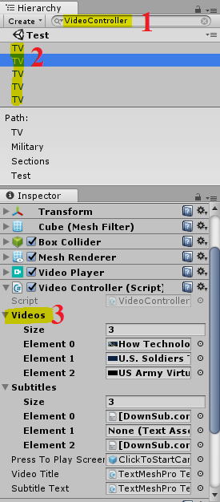

# Udacity_Night-at-the-Museum for [VR Developer Nanodegree](http://udacity.com/vr) program.

### [Youtube link](https://youtu.be/nDbrVf-diOk)

### [Meduim Article](https://medium.com/@osama2o1ooo/experience-vr-in-a-vr-museum-41316d5b66fb)

### Versions Used
- [Unity LTS Release 2017.4.4](https://unity3d.com/unity/qa/lts-releases?version=2017.4)
- [GVR SDK for Unity v1.100.1](https://github.com/googlevr/gvr-unity-sdk/releases/tag/v1.100.1)
- [TextMesh Pro v1.2.2](https://assetstore.unity.com/packages/essentials/beta-projects/textmesh-pro-84126) 
- [ProBuilder v2.9.8](https://assetstore.unity.com/packages/tools/modeling/probuilder-111418) 

### Directory Structure
- The Unity project is the child directory of the repository and named according to the associated lesson.
- The Unity project is 'cleaned' and includes the `Assets` folder, the `ProjectSettings` folder, and the `UnityPackageManager` folder.

>**Note:** If for any reason you remove and re-import GVR SDK for Unity v1.100.1, make sure you accept any API update pop-up prompts triggered by Unity. Alternatively, you can manually run the API updater (Unity menu `Assets` > `Run API Updater...`) after the import has completed.

**Build for Android**

<h1><ins>Some Screenshots:</ins></h1>

# Important Notes:
I didn't upload about 0.5GB of video assets to keep the repo size small.
you can download any video and added it in the museum as u like (and the subtitles are optional)
but here are the links to the videos I used (subtitles are already in the project):
### Udacity_Night-at-the-Museum/Night at the Museum/Assets/_MyVideos/Art&Design/
[360 The starry night Stereo VR experience](https://youtu.be/G7Dt9ziemYA)  
[An Example of the Product Design Process Utilizing Virtual Reality Technology](https://youtu.be/TiY45xUamI0) 
[Tilt Brush- Painting from a new perspective](https://www.youtube.com/watch?v=TckqNdrdbgk) 
[virtual reality 3D modeling software will let you design in mid-air](https://youtu.be/fX4UpMdJkAI) 
### Udacity_Night-at-the-Museum/Night at the Museum/Assets/_MyVideos/Education/
[Explore The Solar System- 360 Degree Interactive Tour!](https://www.youtube.com/watch?v=0ytyMKa8aps&t=185s) 
[VR in Education](https://www.youtube.com/watch?v=EXYzj6qwCCk&t=28s) 
[VR in the Classroom - Tablet Academy](https://www.youtube.com/watch?v=bN3JSk9xrhE&t=60s) 
[Virtual Reality For Training (VR)](https://www.youtube.com/watch?v=1MpUUDr6OFM) 
### Udacity_Night-at-the-Museum/Night at the Museum/Assets/_MyVideos/Gaming/
[Assassin's Creed in 360 Degrees](https://www.youtube.com/watch?v=g0AYnMPkg2k&t=72s)
[Full body VR gaming suit - Teslasuit](https://www.youtube.com/watch?v=fCsjUG6-F4I&t=47s)
[The 'Virtuix Omni' Actually Lets You Run Around Video Games](https://www.youtube.com/watch?v=ugn9YHyvtS8)
### Udacity_Night-at-the-Museum/Night at the Museum/Assets/_MyVideos/Medical/
[Surgical Training in 360-Degree Virtual Reality for Oculus Rift (with intro narration)](https://youtu.be/n7ALZkPoTYQ) 
[Virtual Reality Helps Patients at Cedar Sinai Hospital](https://www.youtube.com/watch?v=0pizYFG8F3A) 
[Virtual Reality in Medicine New Opportunities for Diagnostics and Surgical Planning](https://youtu.be/AttXbcLUyR0) 
[Why Does Virtual Reality Make Me Sick](https://www.youtube.com/watch?v=BznbIlW8iqE) 
### Udacity_Night-at-the-Museum/Night at the Museum/Assets/_MyVideos/Military/
[How Technology Can Turn VR into Powerful Therapy](https://www.youtube.com/watch?v=c-YMV_70KrU) 
[U.S. Air Force HALO 360](https://www.youtube.com/watch?v=jVIJEq3oPW4&t=12s) 
[U.S. Soldiers Train Using Virtual Reality](https://www.youtube.com/watch?v=NND7Hk5fYdI&t=106s) 
[US Army Virtual Reality Military Training](https://www.youtube.com/watch?v=SlKmXVXy0k4) 
## how to add the videos in the museum:
1_) search for VideoController in the scene view or hierarchy
2_) select any of the TVs
3_) add the videos you want in the video list (if any video has a subtitle it has to be in the same index as the video)

P.S. for the subtitles I used [this site to transfer them to TimedText1.0 (.xml/.ttml)](https://gotranscript.com/subtitle-converter)
