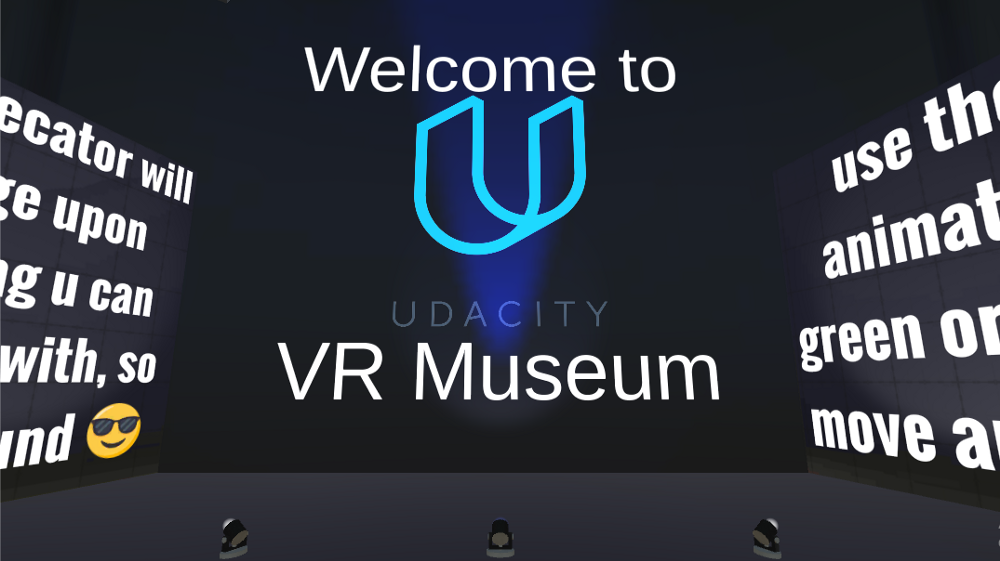
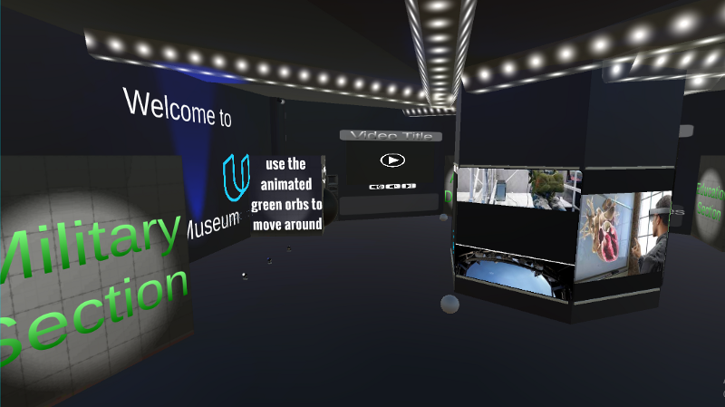
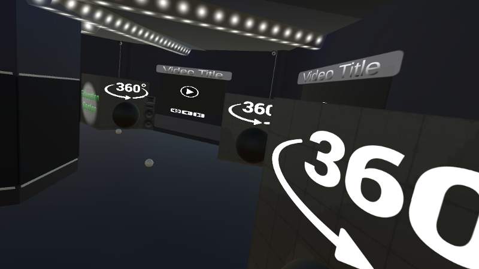

# Udacity_Night-at-the-Museum for [VR Developer Nanodegree](http://udacity.com/vr) program.

### [Youtube link](https://youtu.be/nDbrVf-diOk)

### [Meduim Article](https://medium.com/@osama2o1ooo/experience-vr-in-a-vr-museum-41316d5b66fb)

### Versions Used
- [Unity LTS Release 2017.4.4](https://unity3d.com/unity/qa/lts-releases?version=2017.4)
- [GVR SDK for Unity v1.100.1](https://github.com/googlevr/gvr-unity-sdk/releases/tag/v1.100.1)
- [TextMesh Pro v1.2.2](https://assetstore.unity.com/packages/essentials/beta-projects/textmesh-pro-84126) 
- [ProBuilder v2.9.8](https://assetstore.unity.com/packages/tools/modeling/probuilder-111418) 

### Directory Structure
- The Unity project is the child directory of the repository and named according to the associated lesson.
- The Unity project is 'cleaned' and includes the `Assets` folder, the `ProjectSettings` folder, and the `UnityPackageManager` folder.

>**Note:** If for any reason you remove and re-import GVR SDK for Unity v1.100.1, make sure you accept any API update pop-up prompts triggered by Unity. Alternatively, you can manually run the API updater (Unity menu `Assets` > `Run API Updater...`) after the import has completed.

**Build for Android**

<h1><ins>Some Screenshots:</ins></h1>

